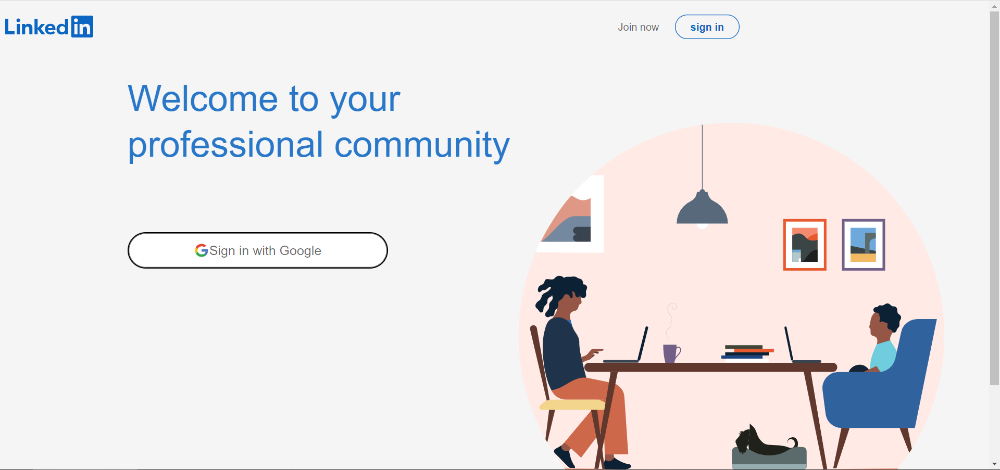

# Linkedin-Clone_Redux

1. **Choose a hosting platform:** There are many hosting platforms available for ReactJS applications, such as Netlify. Choose a platform that meets your needs and budget.
2. **Build the app for production:** Use the `npm run build` command to create a production-ready build of your ReactJS app. This will create a `build` folder containing the optimized code and assets.
3. **Configure the hosting platform:** Configure the hosting platform to deploy your app. This typically involves connecting to a Git repository, specifying the build folder, and configuring any custom settings.
4. **Test and optimize the deployment:** Test the deployment to ensure that the app is running smoothly and quickly. Optimize the app by reducing the size of the assets, using caching and compression, and implementing other best practices.
5. **Share and promote the app**: Once the app is deployed, share and promote it on your resume, LinkedIn profile, and other relevant channels. Consider using SEO and social media marketing to reach a wider audience.

